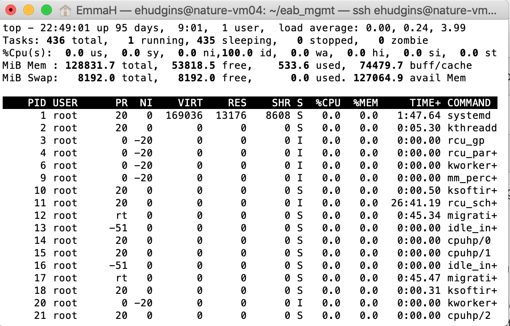

## GitHub + R over SSH for newcomers to the terminal

#### _A quick (and most likely dirty) tutorial written by [Emma Hudgins](mailto:emma.hudgins@carleton.ca) for the Bennett Lab @ Carleton_

>This is also the first real markdown document I have ever made, so I apologize if the formatting is gross!


### 1. Getting set up 
- Make a [Github](https://github.com) account
- Download the [Github Desktop App](https://desktop.github.com)
- Create an [OSF](https://osf.io) account
- Create a [Research Data Management Plan](https://assistant.portagenetwork.ca) for your project

### 2. Using GitHub desktop 
- In the left pane, select **Add** to create a new repository
- Choose **Create new repository** and give the path to the project folder (or create a new folder). The folder can be in your Dropbox/OneDrive etc. for extra backup
- A **Git** pane should now appear in the top right of newer versions of RStudio when you're working in the associated R Project (see 3.4 for more on Git), but you can also set a default text editor (I like [**Sublime**](https://www.sublimetext.com))


### 3. Working remotely  

_Useful for tasks that require a lot of computer power. You don't need to keep your computer open overnight or worry about getting disconnected from the VPN. You only need a few lines of code in the terminal. Lots of cores means you can take advantage of R functions like foreach(), doParallel(), etc. **[email me](mailto:emma.hudgins@carleton.ca) if you want help getting started with these!**_  

> Connect to the [Carleton VPN](https://carleton.ca/its/help-centre/remote-access/) before attempting to connect to any Carleton computer


#### 3.1 Accessing Biology Dept. computers (Windows)  

These machines don't have _OpenSSH_ enabled, so it's a bit harder to share files. 

* Download [Microsoft remote desktop](https://carleton.ca/its/help-centre/remote-access/)
    - Add a new remote connection at the computer address
    ```console
    ehudgins@R-TT4690-03@carleton.ca
    ```
    - When prompted, enter your CUNET login credentials (you might need to say _Yes_ to a message about a fingerprint)
    
    
    
* Open **WinSCP** on the remote machine and establish a connection to your local machine (it should be already installed)
    - Make sure **Remote login** is [enabled](https://knowledge.autodesk.com/support/smoke/troubleshooting/caas/sfdcarticles/sfdcarticles/Enabling-remote-SSH-login-on-Mac-OS-X.html) on your local computer. **UPDATE 03-31** Richard identified this as a potential security threat. It is likely best to use key pair system like [this](https://www.ssh.com/ssh/putty/windows/puttygen) instead to enable remote login (I realized after the workshop that I forgot that I took this step)
    - Google _'What's my IP'_? to figure out your IP address on your local machine
    - Your login credentials are _username@your.IP.address_
    ```console       
    EmmaH@134.117.185.78
    ``` 
    - Once again, you might need to say _Yes_ to a message about a fingerprint before your connection is established
    - Once connected, you can drag and drop files/folders in both directions, and open and edit files in text editor
    - You can also run jobs in the Windows terminal via remote desktop (**Powershell** or **Command Prompt**). Here, the ```setsid``` protocol in 3.5 is likely less useful because the job doesn't stop when your Remote desktop session ends. 
    - Instead of WinSCP, you can use Dropbox or OneDrive to transfer the files, or you can clone github repositories to the computers (see 3.4)


#### 3.2 Sharing files to NCC computers (Ubuntu VMs) 
* For individual file transfer, download [FileZilla](https://filezilla-project.org) (or use [sftp](https://www.cs.fsu.edu/~myers/howto/commandLineSSH.html) from the terminal)
    - your login credentials are sftp://username@server
    ```console
    sftp://ehudgins@nature-vm04.carleton.ca
    ```
* If you want to sync an existing GitHub repository, use git in the terminal (see 3.4, and [see here for more info](http://dept.stat.lsa.umich.edu/~jerrick/courses/stat701/notes/git.html) on working with git in various ways 

#### 3.3 Connecting to a remote server via SSH


* Open terminal (```Ctrl+Alt+T``` on Ubuntu, ```Command+Space``` on Mac to bring up **Spotlight** and search for ```Terminal```, or use the Windows Start menu and look for **Windows Powershell** or **Command Prompt**)
* Type ```ssh user@hostname``` for the remote machine you want to connect to
```console
EmmaH:~/$ ssh ehudgins@nature-vm04.carleton.ca
```
* Enter your password when prompted, (be prepared to say _Yes_ to yet another message about a fingerprint)
* Navigate to the directory where your script is stored (maybe you transfered it there with FileZilla?) using [*cd*](https://linuxize.com/post/linux-cd-command/)

#### 3.4 Configuring git on a remote machine


* To clone a GitHub repo to a remote machine, install *git*
    - in the terminal (for Ubuntu), type
    ```console
    ehudgins@nature-vm04:~/$ sudo apt install git
    ```
    - [see here](https://git-scm.com/book/en/v2/Getting-Started-Installing-Git) for other OS instructions
    - Configure git for your GitHub account
    ```console
    ehudgins@nature-vm04:~/$ git config --global user.email "you@example.com"
    ehudgins@nature-vm04:~/$ git config --global user.name "Your Name"
    ```
* Clone using 
```console     
ehudgins@nature-vm04:~/$ git clone https://github.com/emmajhudgins/example_github_osf
```
* If you update the repo on your local computer, pull from the folder
```console     
ehudgins@nature-vm04:~/example_github_osf$ git pull 
``` 
* If you update the repo on this remote machine, commit changes and push to origin
```console     
ehudgins@nature-vm04:~/example_github_osf$ git add <changed file>
ehudgins@nature-vm04:~/example_github_osf$ git commit -m "<message>"
```   

#### 3.5 Executing a script remotely without killing it when the VPN disconnects via ```setsid```

* Ensure the script is executable by you (Not sure how necessary this is. This has been more of an issue for me with _.sh_ files)
```console     
ehudgins@nature-vm04:~/example_github_osf$ ls -l # check permissions of files in current directory
ehudgins@nature-vm04:~/example_github_osf$ sudo chmod 755 <script.R>
``` 
* Run the script using [setsid](https://linux.die.net/man/2/setsid) **UPDATE 03-31 [```tmux```](https://phoenixnap.com/kb/tmux-tutorial-install-commands) is a more broadly useful alternative to ```setsid```**
```console
ehudgins@nature-vm04:~/example_github_osf$ setsid R CMD BATCH ./1_beta_mortallity_stan.R &
```
* While it runs, check memory/CPU usage in _top_ **UPDATE 03-31 ```htop``` is a pretty alternative to ```top```.**
```console
ehudgins@nature-vm04:~/example_github_osf$ top
```


* By default, a log will be printed to the file _scriptname.Rout_. Change the log file by using the argument ```>logfile``` at the end of your ```setsid``` command
* [Here are some more basic terminal commands](https://dev.to/kymiddleton/reference-guide-common-commands-for-terminal-6no)

#### 3.6 Linking GitHub with OSF

* Follow Jaimie's previous instructions to create a new project from the template
* add your RDMP to the RDMP section of the OSF project
* Add GitHub as an Add-on in your OSF profile in **Settings>>Configure add-on accounts**
* Link GitHub with your OSF account in the **Add-ons** section of the relevant project components (e.g. Analysis)
    - Select **Import Account from Profile**
    - Select the corresponding repo for the project

#### 4. Addendum of regrets

> A brief list of the many bad habits I am still learning to correct

- Making new versions of a script every time I make a change and giving each new script a really uninformative name, which later causes me to forget which is the 'right' one is (I'm bad for using the date, even though the file system always saves the date you create a file anyway...)
- Keeping data and code in the same folder
- Keeping muliple projects in a single folder (I did this because my projects build off one another, but I'm currently working to create stable external copy of my more general data)
- Not using R projects and reading files in from everywhere
- Keeping an RStudio session open for weeks
- Commenting out chunks of code instead of using switches/wrapping code inside functions (but I would argue these aren't always the best option in early stages of analysis OR if you need a million of them)
- writing stuff to _.csv_ insted of _.RDS_ (_.RDS_ is a lot more compact that _.RData_!)
- not making use of dplyr/tidyverse/packrat
- not reusing helper functions across projects
- Commenting/cleaning the code & writing metadata at the time of submission
- Not asking people enough questions when they send me data, then having to email them years later
- Not asking other people about their workflows!
